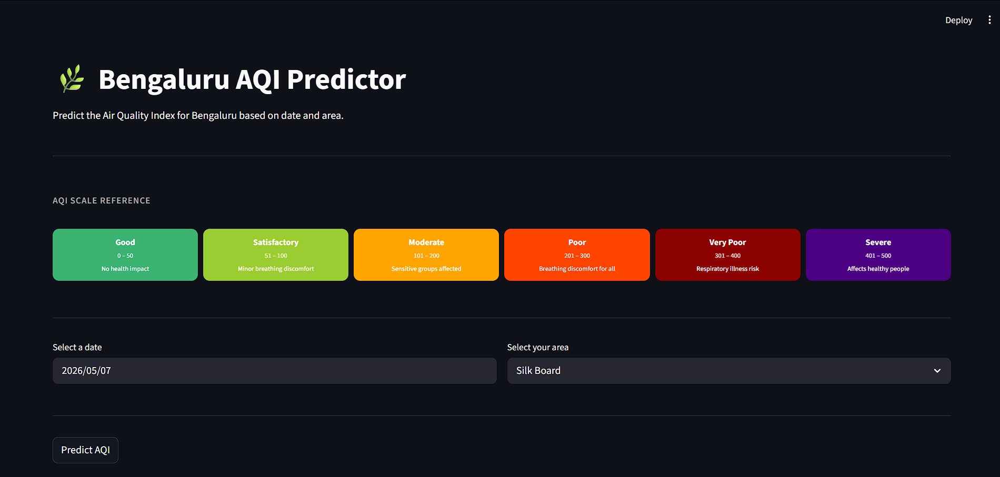
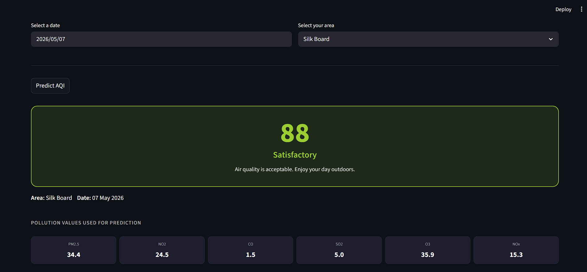
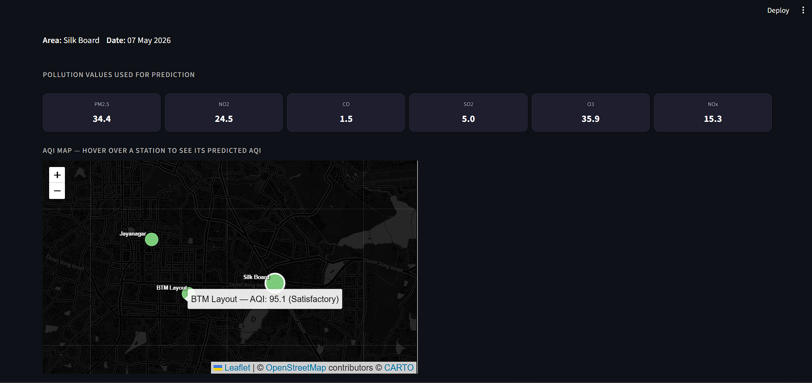

# bengaluru-aqi-prediction
A machine learning web app that predicts the Air Quality Index (AQI) for Bengaluru, India. Built with CatBoost and deployed using Streamlit.

## Project Overview
Air pollution is a critical public health issue in Bengaluru, one of India's fastest-growing cities. This project uses 5 years of historical pollution data (2015–2020) to build a machine learning model that predicts the daily AQI for different areas of the city.
The goal is to make AQI prediction accessible to everyday users with no technical knowledge required. Users simply select a date and their area, and the app predicts the expected air quality along with health advice.

## Tech Stack
- Language: Python 3.10+
- Data Handling: Pandas, NumPy
- Machine Learning: Scikit-learn, CatBoost
- Visualization: Matplotlib, Seaborn, Folium
- Web App: Streamlit, streamlit-folium
  
## Model Performance

| Model | MAE | R2 |
| -------- | -------- | -------- |
| Linear Regression | 6.12 | 0.829 |
| Random Forest | 5.59 | 0.864 |
| CatBoost | 5.48 | 0.87 |

## Screenshots

